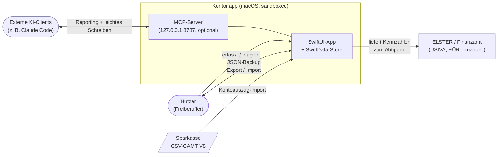
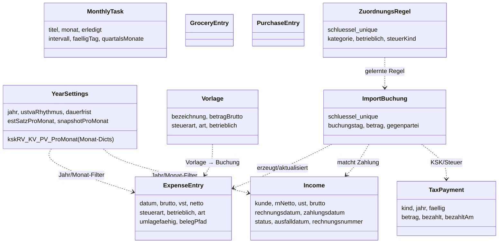
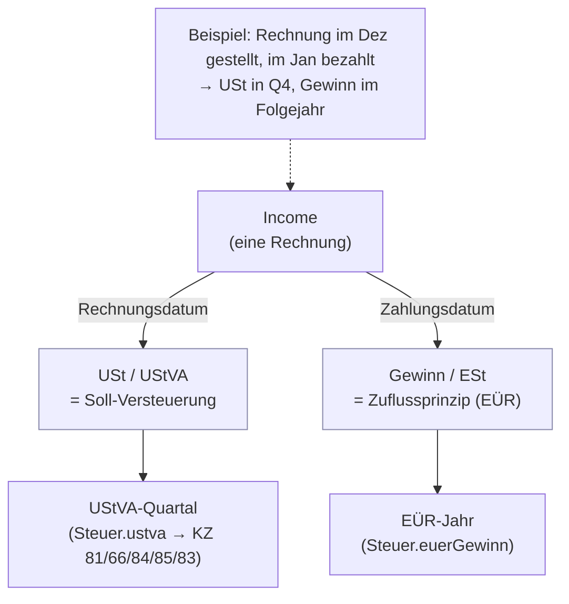
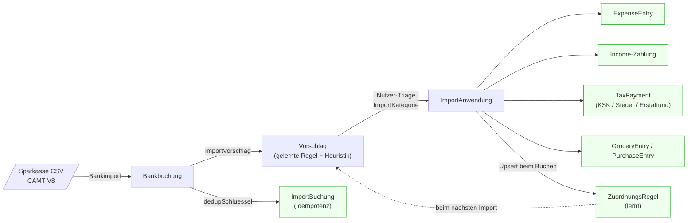

# Architektur

Dieses Dokument beschreibt, **wie Kontor aufgebaut ist** und **warum** die zentralen
Entscheidungen so getroffen wurden. Es ergänzt die [README](README.md) (Was/Geltungsbereich)
und `CLAUDE.md` (Arbeitsanweisungen). Die Diagramme sind Mermaid und rendern direkt auf
GitHub und in Obsidian.

Leitsatz: **Die SwiftData-DB ist die Quelle der Wahrheit.** Die App rechnet nichts in den
Views, sondern in kleinen, rein testbaren Structs/Funktionen unter `Kontor/Berechnung/`.

---

## 1. Kontext

Kontor ist eine **lokale, offline-first** macOS-App für genau eine Steuersituation
(Freiberufler, KSK, EÜR, Soll-Versteuerung, 19 % USt). Kein Backend, keine Telemetrie –
Daten kommen über manuelle Erfassung, einen Bank-CSV-Import und JSON-Backups herein.



Bewusst **nicht** angebunden: kein automatischer ELSTER-Versand, kein Bank-API-Zugriff,
kein Cloud-Sync. Der Kontoabgleich läuft ausschließlich über den lernenden In-App-CSV-Import
(betragsbasiertes Matching war zu fehleranfällig – deshalb auch **nicht** im MCP).

---

## 2. Schichten

Die tragende Regel des Projekts: **keine Rechenlogik in Views.** Alles Testbare liegt in
`Berechnung/` und arbeitet auf neutralen Wert-Structs (`EinnahmePosten`/`AusgabePosten`),
nicht direkt auf den `@Model`-Klassen. Diese Naht macht die Engine in-memory testbar, ohne
den echten Store anzufassen.

```mermaid
flowchart TD
    subgraph views["Views/ — SwiftUI-Module (12)"]
        v["Dashboard · Monatsabschluss · Kontoauszug · Aufgaben<br/>Ausgaben · Einnahmen · UStVA · Jahresabschluss<br/>Privat · Lebensmittel · Anschaffungen · Einstellungen"]
    end

    subgraph model["Model/ — SwiftData @Model"]
        m["Entities · Enums · Helpers"]
    end

    subgraph calc["Berechnung/ — reine Structs/Funktionen (Engine)"]
        seam["Werte: EinnahmePosten / AusgabePosten<br/>(neutrale Posten = Test-Naht)"]
        engine["Steuer · Auswertung · Periode<br/>Bankimport · ImportVorschlag · ImportAnwendung<br/>BelegOCR · Belege · Backup · Demodaten · TaskVorlagen"]
    end

    subgraph server["Server/ — MCP (optional)"]
        s["MCPServer · MCPProtokoll · KontorMCP<br/>Schlusselbund · KISicherung"]
    end

    tests["KontorTests/ — Swift Testing (in-memory)"]

    views -->|@Query / @Bindable| model
    views -->|ruft| engine
    model -->|.posten| seam
    seam --> engine
    server -->|liest/schreibt| model
    server -->|formatiert| engine
    tests -.prüft.-> engine
    tests -.prüft.-> server

    classDef seamNode fill:#ffd,stroke:#aa3;
    class seam seamNode;
```

| Schicht | Ordner | Aufgabe |
|---|---|---|
| **Views** | `Kontor/Views/` | SwiftUI-Module, Inspector-Flyouts, Filter, Hero/Cards (`Stil.swift`, `Komponenten.swift`) |
| **Model** | `Kontor/Model/` | `@Model`-Entitäten, Enums, Helpers – die persistierte Wahrheit |
| **Berechnung** | `Kontor/Berechnung/` | reine Steuer-/Auswertungslogik, Import-Pipeline, Backup, Demodaten |
| **Server** | `Kontor/Server/` | optionaler lokaler MCP für externe KI-Clients |
| **Tests** | `KontorTests/` | Swift Testing, rein in-memory gegen synthetische Fixtures |

---

## 3. Datenmodell

Zehn `@Model`-Klassen. **Bewusst ohne SwiftData-`@Relationship`** – die Entitäten sind lose
gekoppelt und werden bei Bedarf über **fachliche Schlüssel** verbunden (Rechnungsnummer,
Händler-/Dedup-Schlüssel, Steuerart). Das hält das Schema additiv migrierbar und den Import
idempotent.



- **`ExpenseEntry`** trägt **alle Abflüsse**: Betriebsausgabe / Fixkosten / Subscription über
  `art`; privat vs. betrieblich über `betrieblich`. Keine Wiederhol-/Gültigkeitsmechanik –
  es zählt nur das `datum`.
- **`TaxPayment`** ist das Datenmodell für Steuern & Vorsorge (KSK Soll/Ist, ESt, USt).
  Es wird in der `AusgabenView` **mit angezeigt**, geht aber **nie in die EÜR**.
- **`ImportBuchung`** + **`ZuordnungsRegel`** sind das Gedächtnis des Imports
  (Idempotenz über `dedupSchluessel`, Lernen über `haendlerSchluessel`).
- **`YearSettings`** hält Jahres-Config **und** die Monatswerte (KSK KV/RV/PV, ESt-Satz,
  Snapshots) als `[Monat → Decimal/Data]`-Dictionaries, die einzeln vom Vormonat erben.

> ⚠️ Schemaregeln (siehe `CLAUDE.md`): Felder additiv mit Default; **neue Enum-Felder
> MÜSSEN optional sein** (sonst `Optional<Any>`-Cast-Crash beim Öffnen alter Stores); neue
> Felder immer in `Backup.swift` (DTO + snapshot + import) nachziehen.

---

## 4. Die zwei Stichtagslogiken (das Herzstück)

Dieselbe Rechnung wirkt in **zwei verschiedenen Perioden** – das ist die Entscheidung, die
ein Außenstehender sonst nie erraten würde:



Ausgaben analog: USt/Vorsteuer nach Rechnungslogik, EÜR-Wirkung über das Buchungsdatum.
**Privat ≠ betrieblich:** nur betriebliche Posten gehen in EÜR/Vorsteuer; private speisen
ausschließlich die Liquiditätsrechnung („Frei verfügbar").

---

## 5. Kontoauszug-Import-Pipeline

Der einzige automatisierte Dateneingang. Vier rein getestete Schichten in `Berechnung/`,
der Nutzer triagiert jede Bewegung selbst – die App **lernt** daraus.



- **Heuristik:** eigener Übertrag → ignorieren; Eingang → Einnahme; sonst privat.
- **Lernen:** beim Buchen wird die Regel (Händler/Gläubiger-ID → Kategorie) per Upsert
  gespeichert; **Skip lernt nicht**. Ein kleiner, nicht-personenbezogener Start-Regelsatz
  wird beim App-Start idempotent angelegt.
- **Idempotenz:** schon Importiertes (`ImportBuchung`) wird ausgeblendet; erneutes Buchen
  trifft über `ImportAnwendung.ziel` den bestehenden Datensatz → **keine Dubletten**.
- **Sonderfälle:** USt-VZ im Fälligkeitsfenster → Vorjahr; KSK bucht Ist-`TaxPayment`;
  Finanzamt-Eingang → negativer `TaxPayment` (`.steuererstattung`).

---

## 6. Die Berechnungs-Engine

Zwei zentrale, namensgebende Bausteine – beide stateless, beide gegen synthetische Fixtures
getestet (`SteuerrechnerTests`, `KontorTests`, …):

**`Steuer`** (`Steuerrechner.swift`) – die Formeln:

| Funktion | Liefert |
|---|---|
| `ustva(...)` | `UStVAErgebnis` (KZ 81 Netto, ust81, KZ 66/84/85, Zahllast KZ 83) |
| `euerGewinn(...)` | Zufluss-Gewinn (bezahlte Netto-Einnahmen − betriebl. Netto-Ausgaben) |
| `estPauschal(basis:ksk:satz:)` | ESt-Rücklage `(Gewinn − KSK) × Satz` |
| `steuerRuecklage(...)` | `(USt − VSt) + KSK + ESt-Anteil` |
| `reverseChargeNetto/USt` | §13b (KZ 84/85, cash-neutral) |
| `ustKorrekturAusfall` / `ustVzZuordnung` | §17-Forderungsausfall · USt-VZ-Periodenzuordnung |

**`Auswertung`** (`Auswertung.swift`) – verdichtet zu `MonatsAuswertung` / `JahresAuswertung`
für die Abschluss-Views (Gewinn-Waterfall, „Frei verfügbar", EÜR-Jahr, Steuerlast).

`MonatsSnapshot` friert einen abgeschlossenen Monat als JSON ein (`YearSettings.snapshotProMonat`):
danach zeigt der Monat fixe Zahlen statt Live-Rechnung.

---

## 7. Architekturentscheidungen (ADRs, knapp)

Kurzform „Entscheidung — warum". Details in `CLAUDE.md` / README.

1. **SwiftData-DB ist die Quelle der Wahrheit** (nicht mehr die Obsidian-Markdown-Dateien) —
   ein konsistenter, abfragbarer Stand statt händisch gepflegter Notizen.
2. **Geld immer `Decimal`, nie `Double`** — exakte Cent-Beträge, keine Float-Rundungsfehler.
3. **Rechenlogik nur in reinen Structs/Funktionen** — Engine ohne UI/Store in-memory testbar.
4. **Zwei Stichtagslogiken getrennt** (USt = Soll/Rechnungsdatum, EÜR = Zufluss/Zahlungsdatum)
   — bildet die tatsächliche Rechtslage ab; alles andere wäre falsch.
5. **Wiederkehrende Kosten = datierte Buchungen + Vorlagen, KEINE Wiederhol-Mechanik** —
   es zählt nur das Datum; frühere `gueltigVon/bis`/`aktiv`/Materialisierung entfernt.
6. **KSK & ESt = Monatswerte in `YearSettings`, vererbt vom Vormonat** — kein globaler Wert,
   kein separates KSK-Modul; Bescheid-Reihenfolge RV/KV/PV, JAE nur informativ.
7. **ESt-Rücklage ausschließlich pauschal** `(Gewinn − KSK) × Satz` — der frühere
   §32a-Tarifschätzer war bei unterjährigem Datenstand unzuverlässig.
8. **Ein gemeinsames Ausgaben-Ledger** (`ExpenseEntry` + `TaxPayment` über `LedgerZeile`) —
   ein Ort für alle Abflüsse; Steuern/Vorsorge sichtbar, aber **nie in der EÜR**.
9. **Kontoabgleich nur als lernender In-App-CSV-Import** (nicht im MCP) — betragsbasiertes
   Matching war zu fehleranfällig; der Nutzer triagiert, die App lernt.
10. **Schema additiv, neue Enum-Felder optional, Store nie löschen** — die On-Disk-DB ist
    produktive Nutzerdatenbank; nur lightweight Migration, kein Seed/Reset.
11. **Lokal & offline, App-Sandbox an, MCP nur Loopback mit Keychain-Token** — keine
    Telemetrie, kein Cloud-Sync; `network.server`-Entitlement ausschließlich für den MCP.

---

## 8. Build & Test

```bash
cd "~/Projekte/Claude Code/Kontor"
xcodebuild build -scheme Kontor -destination 'platform=macOS' CODE_SIGNING_ALLOWED=NO
xcodebuild test  -scheme Kontor -destination 'platform=macOS' CODE_SIGNING_ALLOWED=NO
```

Neue `.swift`-Dateien einfach in `Kontor/` bzw. `KontorTests/` ablegen
(File-System-Synchronized Groups – kein `project.pbxproj`-Eintrag nötig). Pro Schritt:
bauen + testen, dann ein klarer Commit.
